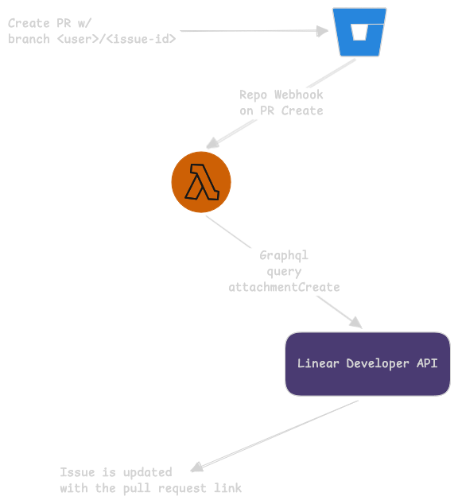
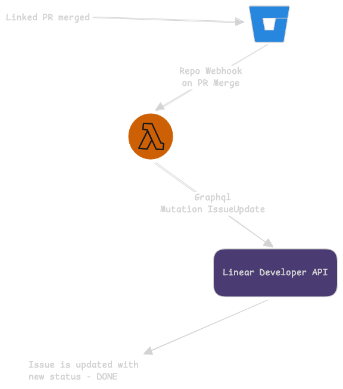

#+title: Linear Integration
#+author: sam@pagesoft.app
#+language: en

Linear project management is a streamlined approach designed specifically for software development teams, focusing on speed, simplicity, and clarity. It combines issue tracking, project planning, and team collaboration into one platform, making it ideal for agile workflows.
Linear can be integrated to other platforms using the linear developer apis. so if there are no out-of-the-box integration for a particular platform. most of it can be integrated to a certain level using this api.

[[https://linear.app/developers][Linear Developers API]]

* Bitbucket to Linear integration
Linear has [[https://linear.app/integrations/github][GitHub]] integration that syncs PR and Merges with the issues. when a PR is created using branch with linear issue id, Linear will add the PR to the issue mark that issue as done once the merge is success. 
There are no similar out-of-the-box integration available for Bitbucket. So a manual approach is to be implemented. Linear has very useful API system using graphql and most of the linear artifacts can be mutated using it. Will have to leverage Bitbucket repository web hooks to automate this.

>Branches and Pull Requests should be able to link with the issue. Using the linear formatted branch name or by mentioning the issue id in the title of the pull request. Check GitHub linear integration to understand the linking.

Since this integration involves Bitbucket web-hooks, each repository should be configured manually or using automation. But each repository should be individually configured. No platform wide integration possible. May be we can automate the whole process while creating a new repository.

** Pull Request Create
Whenever a pull request is created with the linear issue ID. The associate issue can be updated/linked with the PR inside Bitbucket. So the issue will contain all the information regarding an issue including related pull requests. Should be able to attach multiple pull requests if issue ID is mentioned in the pull request title has the issue ID.

#+CAPTION: Pull request create work flow using function/serverless
#+NAME: pr-create

*** Pull Request Linking
Pull request title and the branch name should be matched using regex to find if the pull request is linked to an issue. This logic is to be implemented inside the function. So whenever a pull request is created the function gets invoked and function decides what to do with the pull request.

*** Linear graphql API mutation
Use [[https://linear.app/pagesoft/settings/account/security][Security and access]] settings to generate an API token to authenticate requests to the API. Issues can be mutated using the [[https://linear.app/developers/attachments][graphql]] queries. Read the Linear API Docs for clarity.

** Issue update on successful merge
Whenever a pull request that is linked with any issue is merged successfully the status of the issue to be mutated inside linear. It is a very simple but an effective automation to mark a issue as done.

#+CAPTION: Pull request success work flow using function/serverless
#+NAME: pr-merge

So the pull request will be linked to issue if it qualifies the previous step.  And in this integration we do the same regex match to find the issue ID inside title or branch name. Then [[https://linear.app/developers/graphql#creating-and-editing-issues][IssueUpdate]] graphql mutation is to send along with the state id to which we want to update the issue.

