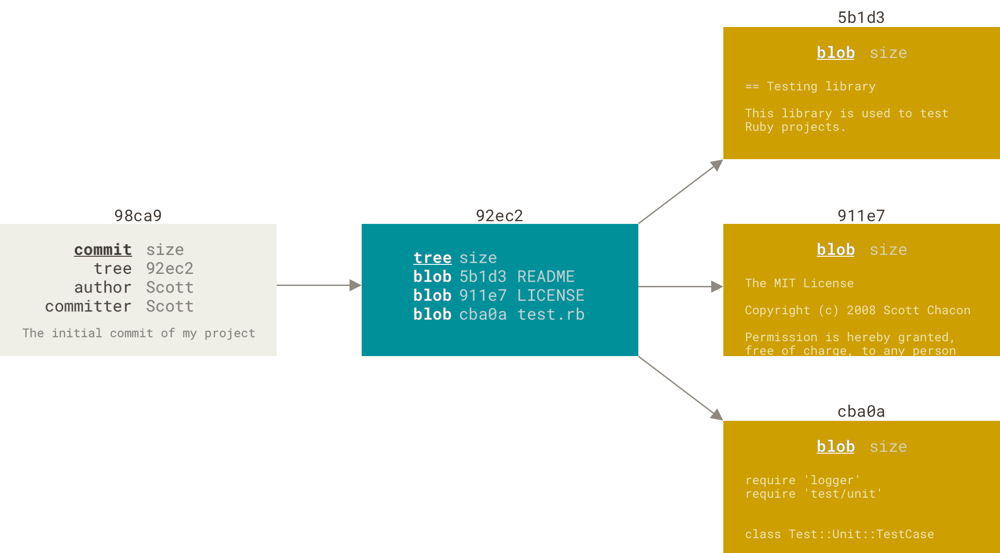
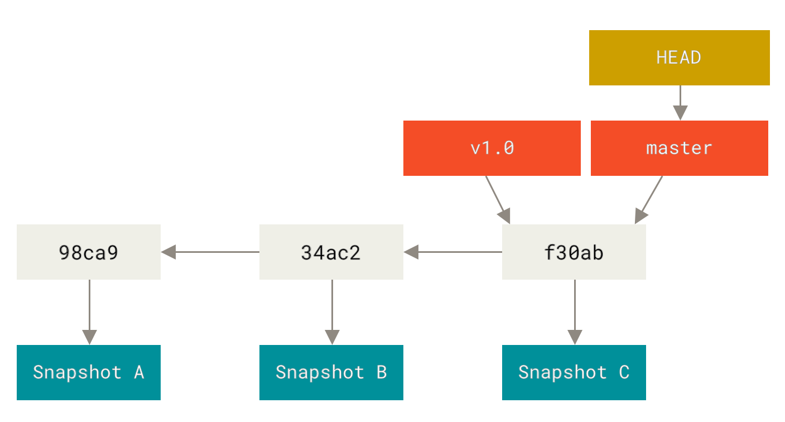

#+title: Advanced Git and Git Discipline
#+author: sam@pagesoft.app
#+language: en

** Prerequisites
To follow along with the hands-on session you atleast need the following software installed in your system. It is the bare minimum to implement everything.
- [[https://git-scm.com/][Git]]
- [[https://www.python.org/][Python 3]]
- [[https://docs.astral.sh/uv/][UV]]
- Git server account (github, gitlab, bitbucket etc..)
  
And most importantly you need a text editor to write the code and a terminal emulator for running commands.

> UV is python package manager that helps with installing packages, handling the virtual environment and running python package commands.

* Introduction
Topics to cover 
1. Merging Branches
   1. Merge Conflict
2. Rebasing Commits and Branches
   1. Squash
   2. Fix up
   3. Drop
   4. Edit
3. Stashing changes
4. Cherry picking Commits
5. Tagging versions

Clone the this [[https://github.com/samthom/linear-issue-updater][repo]] for reference.
All the python snippets can be copy pasted from the documentation. We are not focused on learning about any python topic. 
   
* Project Setup
*** Create a local git repo
Create a new local git repo using ~git init~ command.
#+begin_src sh
mkdir linear-issue-updater
cd linear-issue-updater
# Initialize a fresh git repo
git init
# To see the status
git status
#+end_src

*** Python project setup
We have to Initialize a python project to start.
Run ~uv init~ to Initialize a python project inside the repository. It will create the files and env required for the project along with a readme file.

Now let's install the following dependencies for the project start.
#+begin_src sh
uv add flask pytest requests python-dotenv
#+end_src

Next is adding /.gitignore/ to avoid tracking all the files in the repo. Copy paste this [[https://raw.githubusercontent.com/samthom/linear-issue-updater/refs/heads/main/.gitignore][file]] into newly created /.gitignore/ file.
> We don't want to track our sensitive .env files and .venv folder with plugins.

*** First Commit
Add all files (Or start tracking all the files) ~git add *~
Commit
- ~git commit -m "chore: project setup"~
- ~git commit~
  Use the configured editor to write a better commit message with more context
  
* Our First Mistake
We were supposed to add some documentation to the project setup which we forgot. Update the readme with following markdown snippet.
#+begin_src markdown
# Bitbucket to Linear integration

Linear has [GitHub](https://linear.app/integrations/github) integration that syncs PR and Merges with the issues. when a PR is created using branch with linear issue id, Linear will add the PR to the issue mark that issue as done once the merge is success. 
There are no similar out-of-the-box integration available for Bitbucket. So a manual approach is to be implemented. Linear has very useful API system using graphql and most of the linear artifacts can be mutated using it. Will have to leverage Bitbucket repository web hooks to automate this.

>Branches and Pull Requests should be able to link with the issue. Using the linear formatted branch name or by mentioning the issue id in the title of the pull request. Check GitHub linear integration to understand the linking.

Since this integration involves Bitbucket web-hooks, each repository should be configured manually or using automation. But each repository should be individually configured. No platform wide integration possible. May be we can automate the whole process while creating a new repository.
#+end_src

Since we are yet to push our changes to any remote server we modify our commit. We don't need two commit since this basically belongs to project setup. So we can *amend* this changes to our latest commit
~git commit --amend~
OR
~git commit --amend --no-edit~

  
>Small important and interesting fact is that even though the commit looks the same it is not the same commit. You can see the check sum has changed since the files are changed.

* Remotes
Now we are ready to push this into a remote repo. You can create a remote empty repo. and use ~git remote add <name> <url>~ to add the remote. The common name is /origin/. But you can have multiple remote if needed.
main -> origin/main (local branch to track your remote branch)
Find more doc regarding *Remotes* [[https://git-scm.com/book/en/v2/Git-Basics-Working-with-Remotes][here]]
*** Git Fetch vs Git Pull
Git fetch will fetch all the changes from remote and it will not modify your work tree. But Git pull updates the associated local branch.

* Merging Two Branches
*** Simple merge (fast forward)
Create a new branch ~http-server~ and switch to the new branch.
#+begin_src sh
git branch -b http-server
#+end_src

And let's try to setup a simple http server to have a basic working http server. Add the following to /main.py/
#+begin_src python
from flask import Flask

app = Flask(__name__)

@app.route('/')
def health_check():
    return '.'

if __name__ == "__main__":
    app.run(debug=True, port=8000)

#+end_src

Run the flask app by executing ~uv run main.py~ and check http://localhost:800 to see if the health check endpoint works.
Now we can make a intermediate commit to mark a checkpoint.

Let's add a /Makefile/ to make it easier to run all the commands.
#+begin_src makefile
.PHONY: run

run:
	uv run main.py
test:
	uv run pytest test_app.py --verbose
#+end_src

Another commit to mark another checkpoint.

We don't have any tests for this end point yet. Lets add /test_app.py/
#+begin_src python
import pytest
from main import app

@pytest.fixture
def client():
    with app.test_client() as client:
        yield client

def test_healthcheck(client):
    response = client.get('/')
    assert response.status_code == 200
    assert response.data == b"."
#+end_src

Now our final commit before pushing.

~git log --oneline -4~
To check our last 4 commits.
We cannot push this to main or merge this to main. Our commit history is little dirty. Let's clean it up.

**** Interactive Rebasing
We can kick of  editing our commits by running ~git rebase -i HEAD~4~
- Change the order of the commit and play it out
- Squash commits to a single commit to make more meaningful commit

Now we have a clean commit message and ready to merge to the /main/ branch. Checkout to /main/ and then merge by ~git merge http-server~.
You will see in the result that it is a fast forward merge.

CAPTION: Simple branching 
#+NAME: simple-branching
[[./assets/basic-branching.png]]

CAPTION: Commits structure
#+NAME: commit-tree

CAPTION: Branch structure
#+NAME: branches

We are basically updating the commit stored inside the branch information. This is possible because 

*** Three way merge (recursive)
Let's start working on the next feature. Start with creating a new branch for it. 
>Git is designed for you to create n number of branches. It is actually encouraged to create branches for new features and fixes.

~git branch pr-linking~

Currently we are in /main/. And we have a working piece of software but we did not add any license (It is a simulation scenario). Let's create /LICENSE/ file and add GPL-3 [[https://raw.githubusercontent.com/samthom/linear-issue-updater/refs/heads/main/LICENSE][license]] to it. Then commit it with good message.

Now we have a new commit in /main/ branch which is not inside the new branch /pr-linking/

Let's update the /pr-linking/ branch with new endpoint.

Add the following to /main.py/
#+begin_src python
from flask import Flask, request
from dotenv import load_dotenv
import requests
import re
import os

load_dotenv()
 
app = Flask(__name__)

@app.route('/')
def health_check():
    return '.'

@app.route('/sync-linear', methods=['POST'])
def sync_linear():
    event = request.headers.get("x-event-key")
    payload = request.get_json()
    pr_data = payload.get("pullrequest", {})
    pr_title = pr_data.get("title", "")
    pr_url = pr_data.get("links", {}).get("html", {}).get("href")
    
    match = re.search(r'[A-Z]+-\d+', pr_title)
    if not match:
        return { "message": "No linear issue ID found"}, 202

    linear_issue_id = match.group(0)
    api_key = os.environ.get('LINEAR_API_KEY', '')

    mutation = """
    mutation CreateAttachment($issueId: String!, $url: String!, $title: String!) {
         attachmentCreate(input: {
           issueId: $issueId,
           url: $url,
           title: $title,
           iconUrl: "https://bitbucket.org/favicon.ico"
         }) {
           success
         }
       }
    """
    vars = {
            "issueId": linear_issue_id,
            "url": pr_url,
            "title": f"Bitbucket PR: {pr_title}"
        }

    
    r = requests.post(
        "https://api.linear.app/graphql",
        headers={"Authorization": api_key},
        json={"query": mutation, "variables": vars}
    )
    if r.status_code != 200:
        response = r.json()
        errors = response.get('errors')
        error = errors[0]
        content = { "message": error.get('message', '') }
        return content, r.status_code
    return { "message": "Success" }, 200

if __name__ == "__main__":
    app.run(debug=True, port=8000)

#+end_src

